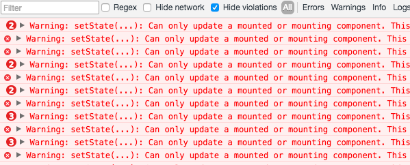

# 组件生命周期

## 一、挂载阶段的组件生命周期

- `componentWillMount`: 组件挂载开始之前，也就是在组件调用 render 方法之前调用。
- `componentDidMount`: 组件挂载完成以后，也就是 DOM 元素已经插入页面后调用。
- `componentWillUnmount`: 组件对应的 DOM 元素从页面中删除之前调用。

---

在 JSX 中 , 下面的代码:

```jsx
ReactDOM.render(<Header />, document.getElementById("root"));
```

会编译成：

```JavaScript
ReactDOM.render(
  React.createElement(Header, null),
  document.getElementById('root')
)
```

`React.createElement`会如何处理`Header`和`document.getElementById('root')`两个参数?我们可以简单猜想一下

```JavaScript
// React.createElement 中实例化一个 Header
const header = new Header(props, children)
// React.createElement 中调用 header.render 方法渲染组件的内容
const headerJsxObject = header.render()

// ReactDOM 用渲染后的 JavaScript 对象来来构建真正的 DOM 元素
const headerDOM = createDOMFromObject(headerJsxObject)
// ReactDOM 把 DOM 元素塞到页面上
document.getElementById('root').appendChild(headerDOM)
```

我们把 **React.js 将组件渲染，并且构造 DOM 元素然后塞入页面的过程称为组件的挂载**

React.js 内部对待每个组件都有这么一个过程，也就是初始化组件 -> 挂载到页面上的过程

```JavaScript
-> constructor()
-> render()
// 然后构造 DOM 元素插入页面
```

React.js 为了让我们能够更好的掌控组件的挂载过程，往上面插入了两个方法：`componentWillMount`和`componentDidMount`

```JavaScript
-> constructor()
-> componentWillMount()
-> render()
// 然后构造 DOM 元素插入页面
-> componentDidMount()
```

一个组件可以插入页面，当然也可以从页面中删除。

React.js 也控制了这个组件的删除过程。在组件删除之前 React.js 会调用组件定义的 `componentWillUnmount`：

```JavaScript
-> constructor()
-> componentWillMount()
-> render()
// 然后构造 DOM 元素插入页面
-> componentDidMount()
// ...
// 即将从页面中删除
-> componentWillUnmount()
// 从页面中删除d
```

### 注意

对于一个组件来说，`constructor` 、`componentWillMount`、`componentDidMount`、`componentWillUnmount` 这几个方法

- #### `constructor`: 一般来说，所有关于组件自身的状态的初始化工作都会放在 constructor 里面去做。比如`state`的初始化工作

```jsx
class Index extends Component {
  constructor () {
    super()
    this.state = {
      date: new Date()
    }
  }
...
}
```

- #### `componentWillMount`: 一些组件启动的动作，包括像 `Ajax` 数据的拉取操作、一些定时器的启动等，就可以放在 `componentWillMount` 里面进行，例如 `Ajax`请求：

```jsx
...
componentWillMount () {
  ajax.get('http://json-api.com/user', (userData) => {
    this.setState({ userData })
  })
}
...
```

- #### `componentWillUnmount`:如果我们在定时器在中使用了`setState`

```jsx
componentWillMount () {
  this.timer = setInterval(() => {
    this.setState({ date: new Date() })
  }, 1000)
}
```

由于 `setState` 只能在已经挂载或者正在挂载的组件上调用，组件隐藏的时候，定时器的回调函数还在不停地尝试 `setState` , React.js 就会开始疯狂报错。



这时候`componentWillUnmount` 就可以派上用场了，它的作用就是在组件销毁的时候，做这种清场的工作。在组件销毁的时候清除该组件的定时器：

```jsx
...
componentWillUnmount () {
  clearInterval(this.timer)
}
...
```

这时候就没有错误了。

### 总结

- `componentWillMount`: 组件挂载开始之前，也就是在组件调用 render 方法之前调用。
- `componentDidMount`: 组件挂载完成以后，也就是 DOM 元素已经插入页面后调用。
- `componentWillUnmount`: 组件对应的 DOM 元素从页面中删除之前调用。

## 二、更新阶段的组件生命周期

组件的挂载指的是将组件渲染并且构造 DOM 元素然后插入页面的过程。这是一个从无到有的过程，React.js 提供一些生命周期函数可以给我们在这个过程中做一些操作。

除了挂载阶段，还有一种“更新阶段”。说白了就是 setState 导致 React.js 重新渲染组件并且把组件的变化应用到 DOM 元素上的过程，这是一个组件的变化过程。而 React.js 也提供了一系列的生命周期函数可以让我们在这个组件更新的过程执行一些操作。

### 关于更新阶段的组件生命周期：

1. `shouldComponentUpdate(nextProps, nextState)` : 你可以通过这个方法控制组件是否重新渲染。如果返回 false 组件就不会重新渲染。这个生命周期在 React.js 性能优化上非常有用。
2. `componentWillReceiveProps(nextProps)` : 组件从父组件接收到新的 props 之前调用。
3. `componentWillUpdate()` : 组件开始重新渲染之前调用。
4. `componentDidUpdate()` : 组件重新渲染并且把更改变更到真实的 DOM 以后调用。

[官方文档](https://reactjs.org/docs/react-component.html)
