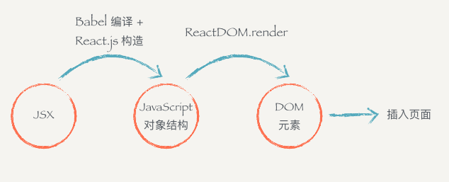

# JSX 原理

思考一个问题：如何用 JavaScript 对象来表现一个 DOM 元素的结构，
举个例子：

```html
<div class="box" id="content">
  <div class="title">Hello</div>
  <button>Click</button>
</div>
```

会发现一个 DOM 元素包含的信息其实只有三个：`标签名`，`属性`，`子元素`。

所以上面这个 HTML 所有的信息我们都可以用合法的 JavaScript 对象来表示：

```JavaScript
{
  tag: 'div',
  attrs: { className: 'box', id: 'content'},
  children: [
    {
      tag: 'div',
      arrts: { className: 'title' },
      children: ['Hello']
    },
    {
      tag: 'button',
      attrs: null,
      children: ['Click']
    }
  ]
}
```

会发现，HTML 的信息和 JavaScript 所包含的结构和信息其实是一样的，我们可以用 JavaScript 对象来描述所有能用 HTML 表示的 UI 信息。但是用 JavaScript 写起来太长了，结构看起来又不清晰，用 HTML 的方式写起来就方便很多了。

React.js 就把 JavaScript 的语法扩展了一下，让 JavaScript 语言能够支持这种直接在 JavaScript 代码里面编写类似 HTML 标签结构的语法，这样写起来就方便很多了。编译的过程会把类似 HTML 的 JSX 结构转换成 JavaScript 的对象结构。

> 可以在babel的官网中快速查看转换的过程：https://babeljs.io/repl/#?presets=react

代码：

```react
import React, { Component } from 'react'
import ReactDOM from 'react-dom'
import './index.css'

class Header extends Component {
  render () {
    return (
      <div>
        <h1 className='title'>React 小书</h1>
      </div>
    )
  }
}

ReactDOM.render(<Header />,document.getElementById('root'))
```

经过编译以后会变成：

```react
import React, { Component } from 'react'
import ReactDOM from 'react-dom'
import './index.css'

class Header extends Component {
  render () {
    return (
     React.createElement(
        "div",
        null,
        React.createElement(
          "h1",
          { className: 'title' },
          "React 小书"
        )
      )
    )
  }
}

ReactDOM.render(React.createElement(Header, null),document.getElementById('root'));
```

`React.createElement` 会创建一个 JavaScript 对象来描述你 HTML 结构的信息，包括标签名，属性，还有子元素等。这样的代码就是合法的 JavaScript 代码了。所以使用 React 和 JSX 的时候一定要经过编译的过程。

**所谓的 ```JSX``` 其实就是 ```JavaScript ```对象**每当在 JavaScript 代码中看到这种 JSX 结构的时候，脑子里面就可以自动进行转化，这样理解 React.js 的组件写法.

最后将这个 DOM 元素渲染到页面上`ReactDOM.render`

```JavaScript
ReactDOM.render( <Header />, document.getElementById('root'))s
```



